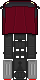
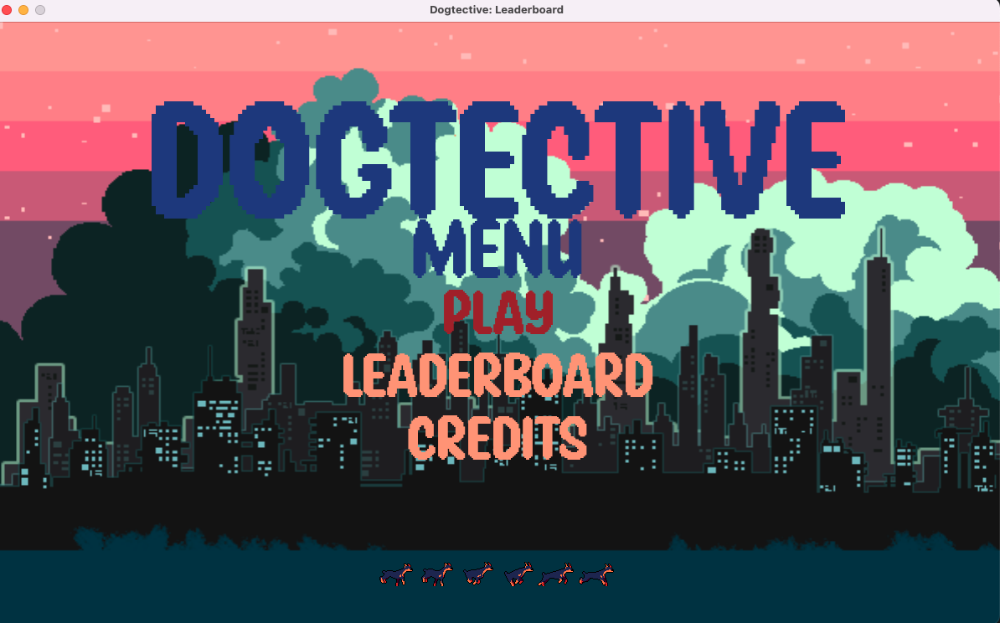
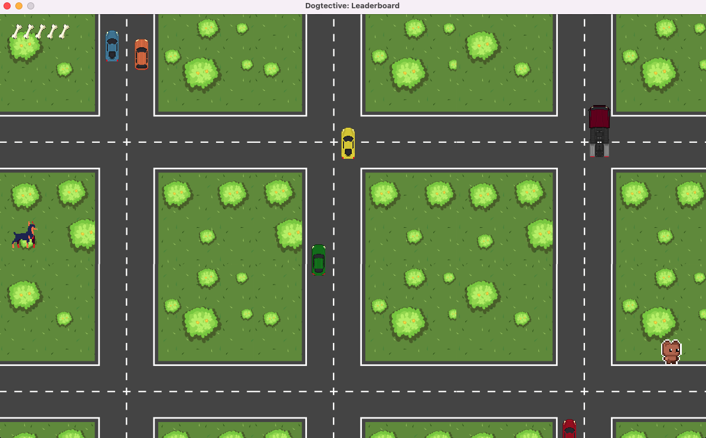
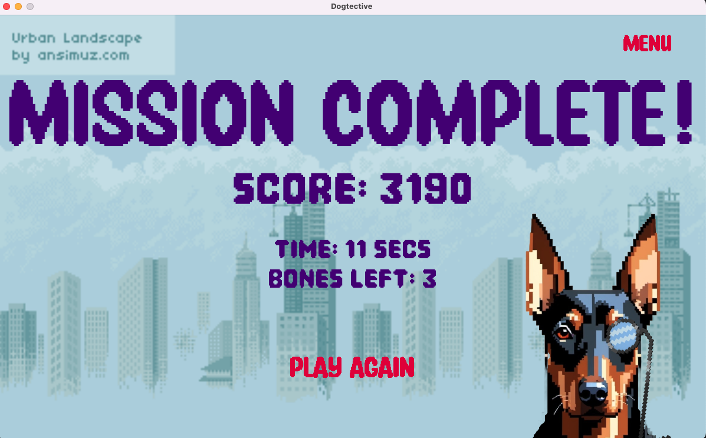
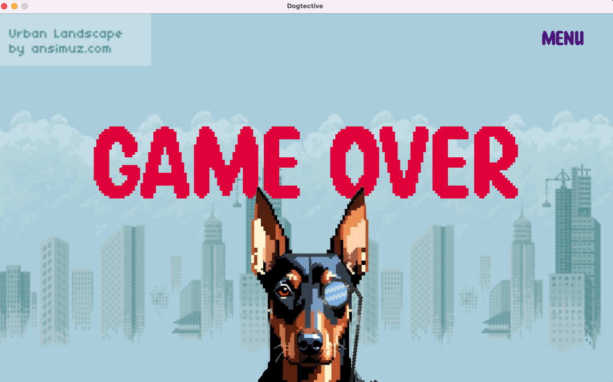
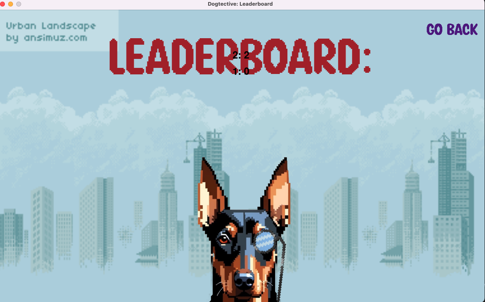
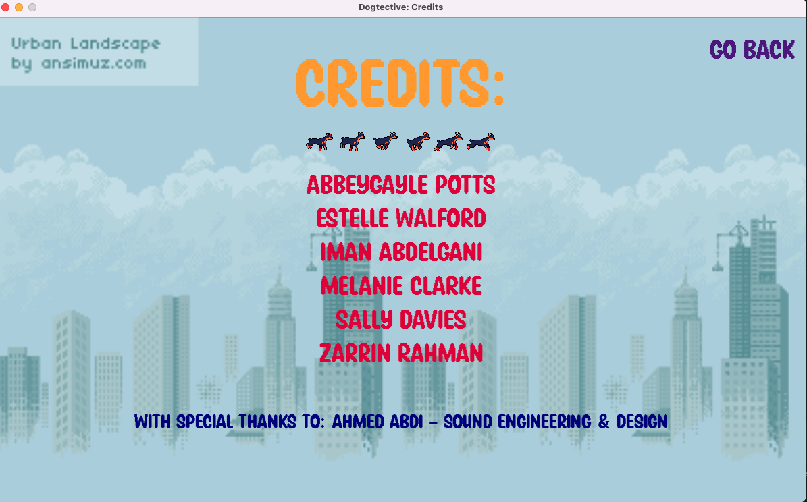

# Dogtective

The main character, a determined dog detective, is on a mission to recover a lost toy.
The toy has gone missing and Dogtective must dodge the moving cars to find it!

## Gameplay Mechanics:

### Navigation

Use mouse clicks for main menu and end screen navigation.

### Movement

Control Dogtective movements using the keyboard arrow keys (up, down, left and right).

### Health

Dogtective starts the game with five health bones in the top-left corner of the screen.

Colliding with vehicles reduces Dogtective's health _(bone count)_ with the amount lost depending on vehicle type:

-  &nbsp; 1 bone damage
-  &nbsp; 1 bone damage
-  &nbsp; 1 bone damage
-  &nbsp; 2 bone damage
-  &nbsp; 2 bone damage
-  &nbsp; 4 bone damage

### Timer

The game uses a background timer to calculate how much time the player has taken to complete the game, which is used to
calculate the score below.

### Scoring

**Health Bonus:**
Earn **1000 points** for each health bone left at the end of the game.

**Time Bonus:**
Finish in under 30 seconds for extra points. The player receives **10** points for every second left.

**Examples:**

- Finish with 4 bones in 15 seconds -> 4000 + 150 = **4150** points
- Finish with 5 bones in 30 seconds -> 5000 + 0 = **5000** points

## Game demo - MC TO UPDATE VIDEO - THIS IS SAMPLE ONLY TO CHECK LINK WORKS

Click below to see the game in action!

[Dogtective Demo](https://drive.google.com/file/d/1xl2yJtKlrdo8W8zOoIzRfUl1eU_ZFgVH/view?usp=drive_link)

## Game screenshots

**Main menu:**



**Gameplay:**



**Mission Complete:** MC TO UPDATE IN LINE WITH LEADERBOARD



**Game Over:**



**Leaderboard:** MC TO UPDATE IN LINE WITH END SCREEN



**Credits:**



## Set-up

To ensure the game runs smoothly, please follow the configuration steps below:

### 1. Config

Within your IDE, go to `logic/score_db_connection/config.py`.

Add your database username and password into the appropriate fields in order to connect to the database.

### 2. SQL script

Within your IDE, go to `logic/score_db_connection/dogtective_scores_db.sql`.

Run the `dogtective_scores_db.sql` script _(i.e. in SQLWorkbench or similar programme)_ to create the database.

### 3. Requirements/Dependencies

Please refer to `requirements.txt` for all dependencies that need to be installed for the game to run successfully.

**Note**: If you experience issues connecting to the database, consider the following troubleshooting steps:

- Conflicts may occur if both mysql-connector and mysql-connector-python packages are installed.
    - It may be advisable to check only mysql-connector-python is installed for this project


- Should you encounter further issues, please try uninstalling and reinstalling mysql-connector-python:

```
pip uninstall mysql-connector-python
pip install mysql-connector-python
```

### 4. Run

Run the `game-runner` python file to start the game. Dogtective needs your help! 😄

## Testing

**Unit Tests**

Unit tests are included within the Python project files to validate the scoring component of the game.

**Gherkin Testing**

Behavior-driven testing using Gherkin scenarios was conducted to verify key game features and workflows.

[Dogtective Gherkin Testing Document](https://docs.google.com/document/d/1CAA7vhVbutaQlb3D5VKj_CWAI0k222RVCaKzvvJZVbU/edit?usp=drive_link)

## Activity Log

[Activity Log](https://docs.google.com/spreadsheets/d/1K7v3ajb6SNFz8l4yX08zlXcnUgO-Eq2qG3q0EH3rtWQ/edit?usp=drive_link)

## Technologies used

- Python
- Pygame
- mySQL

## Credits

- [Road background](https://www.freepik.com/free-vector/aerial-scene-intersection_5361164.htm#fromView=search&page=1&position=6&uuid=a2915187-2a0e-49fe-b8a5-0a10b6afb006)
- [Dogtective game play sprites](https://free-game-assets.itch.io/free-street-animal-pixel-art-asset-pack)
- [City background](https://lucky-loops.itch.io/parallax-city-background)

## Contributors

- [Abbeygayle Potts](https://github.com/AbbeygayleP)
- [Estelle Walford](https://github.com/esterwalf)
- [Iman Abdelgani](https://github.com/AversionToDeepWater)
- [Melanie Clark](https://github.com/Melanie-Clark)
- [Sally Davies](https://github.com/baby-sal)
- [Zarrin Rahman](https://github.com/z-for-zarrin)